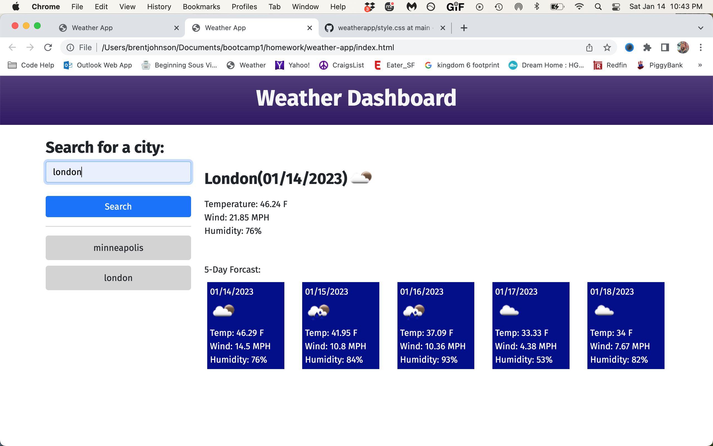

#  Weather Dashboard

## Description

The following is a weather dashboard application that allows a user to enter and search a city for todays weather and the 5 day forcast.

## Technolgies Used

Html, javascript css, bootstrap, and use of 3rd party api from open weather map.

Useing the [5 Day Weather Forecast](https://openweathermap.org/forecast5) we retrieve weather data for cities. The base URL should look like the following: `https://api.openweathermap.org/data/2.5/forecast?lat={lat}&lon={lon}&appid={API key}`. 


## User Story

```
AS A traveler
I WANT to see the weather outlook for multiple cities
SO THAT I can plan a trip accordingly
```

## Acceptance Criteria

```
GIVEN a weather dashboard with form inputs
WHEN I search for a city
THEN I am presented with current and future conditions for that city and that city is added to the search history
WHEN I view current weather conditions for that city
THEN I am presented with the city name, the date, an icon representation of weather conditions, the temperature, the humidity, and the wind speed
WHEN I view future weather conditions for that city
THEN I am presented with a 5-day forecast that displays the date, an icon representation of weather conditions, the temperature, the wind speed, and the humidity
WHEN I click on a city in the search history
THEN I am again presented with current and future conditions for that city
```

## Mock-Up

The following image shows the web application's appearance and functionality:



## Deployed

[Click here for deployed JavaScript Quiz](https://github.com/DevBrent3274/weatherapp)
- - -
© 2022 edX Boot Camps LLC. Confidential and Proprietary. All Rights Reserved.
